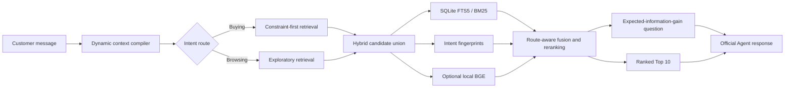

# Cartographer

**Entropy-guided conversational product search for the TechJam 2026 Shopping Copilot challenge.**

Cartographer treats shopping dialogue as active search. On every turn it ranks the best products it can identify *and* asks the question expected to remove the most uncertainty. It runs locally on CPU, uses no paid API, reports zero LLM tokens, and preserves the organizer's required `Agent` interface.

## Why this approach

Keyword search is effective once a shopper knows the exact product terms, but weak for vague browsing, evolving preferences, and corrections. Cartographer compiles each product into a structured intent fingerprint and maintains an explicit, replaceable session state. It can therefore distinguish hard constraints from soft preferences, forget superseded intent, avoid repeating known misses, and choose clarification attributes according to expected information gain.



## Features

- Buying/Browsing intent routing with deterministic, explainable behavior.
- Structured constraints with strength, source turn, active state, and intent epoch.
- Explicit correction handling that removes stale preferences while retaining the category.
- Boundary handling that records “no preference” without creating a false negative constraint.
- Catalog-derived fingerprints for category, material, color, size, style, brand, budget, features, and use case.
- Persistent SQLite FTS5 index and reciprocal-rank-style lexical features.
- Optional offline `BAAI/bge-small-en-v1.5` embeddings and MiniLM cross-encoder.
- Optional route-specific linear reranker promoted only by out-of-fold score gains.
- Entropy-based next-best-question selection with profile-aware attribute priors.
- Precision-gated recommendation depth: a short, high-confidence shortlist on the early turns of an intent epoch, widening as constraints accumulate, with a hard floor that restores full lists on later turns.
- Confidence-adaptive orchestration: recommendation breadth is re-planned each turn from the live rank-one-versus-rank-two score margin, so the agent declines to widen a list it is not confident in.
- Over-generality cutoff: when the candidate union is too large to answer with a list, the agent returns a probe and spends the turn on a structured clarification prompt instead.
- Optional long-term personalization: finished sessions are distilled into a durable per-shopper profile of attributes and categories, reloaded on their next visit.
- Implicit negative feedback: products returned on an unsuccessful turn are not repeated.
- Diagnostic traces kept outside the strict official response schema.

## Repository layout

```text
cartographer/                 Runtime engine and development commands
  engine.py                   Turn orchestration, depth gate, adaptive breadth
  dialog.py                   Conversational state machine and intent override
  retrieval.py                Hybrid candidate union and route-aware scoring
  clarification.py            Expected-information-gain question selection
  ranker.py                   Dependency-free learned residual reranker
  profile_memory.py           Long-term personalized context distillation
  dashboard.py                Local diagnostic and demonstration dashboard
starter/agent.py              Official Agent entry point
evaluator/local_evaluator.py  Organizer-provided deterministic evaluator
tests/                        Contract, scenario, integrity, and unit tests
docs/                         Competition rules and submission materials
data/                         Public sessions and local catalog location
synthetic_800_v1.jsonl        Held-out 800-session set used for generalization checks
```

## The four challenge pillars

| Pillar | Where it lives |
|---|---|
| **I. Intent routing and hybrid pipeline** | `dialog.py` route selection; `retrieval.py` constraint-first Buying track, diversified Browsing track, and the FTS5 + category + fingerprint + optional dense union |
| **II. Multi-turn dialog strategy** | `dialog.py` incremental slots and intent-override rewriting; `clarification.py` information-gain questions; the over-generality cutoff in `engine.py` |
| **III. Self-evolution** | Confidence-adaptive breadth in `engine.py`; long-term profile distillation in `profile_memory.py` |
| **IV. Evaluation** | `evaluator/local_evaluator.py`, unmodified, plus the dashboard and experiment harness |

## Setup

Python 3.10 or newer is required. The deterministic runtime uses only the Python standard library.

1. Download `catalog.jsonl.gz` from the [official participant release](https://github.com/TechJam2026/techjam-conversational-search/releases/tag/participant-kit).
2. Verify its SHA-256 checksum using the release's `SHA256SUMS` file.
3. Extract it to `data/catalog.jsonl`.
4. Build the persistent lexical index:

```bash
python3 -m cartographer.build_index
```

The agent automatically builds an in-memory FTS index if the cached index is absent, but the persistent index materially improves startup time.

### Optional semantic routes

Install the declared local-model dependencies and precompute BGE embeddings:

```bash
python3 -m pip install -r requirements.txt
python3 -m cartographer.build_embeddings --device cuda --batch-size 128 --dtype float32
```

On a Windows NVIDIA laptop, the one-command path creates an isolated environment, installs CUDA PyTorch, downloads and verifies the frozen catalog when necessary, retries safe batch sizes, and verifies the completed artifact:

```powershell
powershell -ExecutionPolicy Bypass -File scripts\generate_embeddings_gpu.ps1 -CreateArchive
```

Use `-TorchIndexUrl` if the laptop requires a different CUDA wheel index selected from the official PyTorch installer. Generated matrices, model files, and the optional transfer ZIP remain ignored by Git.

The setup command saves both document embeddings and a local copy of the query encoder under `data/cartographer_index/`, validates the frozen catalog checksum and ASIN row ordering, and allows inference without network access. See [docs/GPU_EMBEDDING_HANDOFF.md](docs/GPU_EMBEDDING_HANDOFF.md) for the cross-machine workflow. To cache the experimental cross-encoder as well:

```bash
python3 -m cartographer.build_index --with-cross-encoder
```

Both semantic extensions ship disabled, and that is a measured decision rather than unfinished work. The dense route was built, checksum-verified and evaluated on three independent instruments: a 26-configuration end-to-end grid spanning less than three sessions of resolution, a fixed-message replay in which every dense variant *degraded* turn-one ranking, and a dense-retrained cross-validation gaining an order of magnitude less than the promotion gate. The cause is that this customer discloses requirements as verbatim substrings of a product's own text, which exact matching resolves precisely and cosine similarity blurs. The cross-encoder was never promoted because dense never cleared its gate. Missing optional packages or model assets never prevent the deterministic agent from running.

After importing a GPU-built artifact, follow the score, scenario, determinism, and latency gates in [docs/SEMANTIC_PROMOTION.md](docs/SEMANTIC_PROMOTION.md). Dense inference is deliberately opt-in and cannot silently change the official agent merely because artifacts exist.

After selecting the semantic configuration, [docs/LEARNED_RANKER.md](docs/LEARNED_RANKER.md) describes the locked 100/100 development and holdout procedure for the dependency-free residual reranker.

## Run and reproduce

Run every test:

```bash
python3 -m unittest discover -v
```

Run the untouched official evaluator:

```bash
python3 -m evaluator.local_evaluator --output results.json
```

Inspect a complete conversational trace:

```bash
python3 -m cartographer.demo --sample-id public_0002
```

Launch the local evaluator observatory to inspect every target, replay the full agent beside a selected component ablation, explain every recommendation's dominant score signals, measure reranker/gate/retrieval/state/clarification value overall and by scenario, and start a fresh-process evaluation after any saved code update. A dataset-scope selector switches all panels between the public 200, an optional held-out set such as `synthetic_800_v1.jsonl`, and the two merged:

```bash
python3 -m pip install -r requirements-dashboard.txt
python3 -m cartographer.dashboard --inbrowser
```

For a clean walkthrough — the view used in the demo video — hide the developer-only diagnostic panels:

```bash
python3 -m cartographer.dashboard --presentation --inbrowser
```

See [docs/DASHBOARD.md](docs/DASHBOARD.md) for the panel guide and methodology warnings.

`docs/public_split_v1.json` is a locked artifact: `python3 -m cartographer.data_split` regenerates it and deliberately refuses to overwrite a manifest that differs, so the split cannot drift silently. It is a verification command, not a setup step.

Run component ablations or five-fold weight tuning:

```bash
python3 -m cartographer.experiments --mode ablation --output ablation_results.json
python3 -m cartographer.experiments --mode tune --output tuning_results.json
```

Reproduce the locked public split and development-only reranker:

```bash
python3 -m cartographer.train_ranker --split all --rrf-k 120 --routes buying,browsing,boundary,override --route-scales buying=1.25,boundary=0.75,override=0.75,browsing=0.75 --cross-validate --output cartographer/ranker_weights.json
```

The holdout comparison command is documented in [docs/LEARNED_RANKER.md](docs/LEARNED_RANKER.md). It is an audit command, not a tuning loop.

## Official interface

```python
from starter.agent import Agent

agent = Agent("data/catalog.jsonl")
agent.reset("session-1", user_profile)
response = agent.respond("session-1", user_message, turn=1, top_k=10)
```

The response contains only `message`, `ask_attribute`, `recommendations`, and zero-valued `usage`. Diagnostics are accessed separately with `agent.get_trace(session_id)` and are never sent to the evaluator.

## Evaluation

The published starter baseline has Hit Rate@10 `0.125`, MRR `0.068034`, MTTC `9.81`, and computed TechnicalScore `0.10671`.

The submitted agent is fitted on all 200 labelled public sessions and scored with the unmodified official evaluator across 1,000 labelled sessions — the 200 public sessions plus the disjoint 800-session held-out synthetic set:

| Split | Sessions | TechnicalScore | Hit Rate@10 | MRR | MTTC |
|---|---:|---:|---:|---:|---:|
| All labelled sessions | 1000 | **`0.973062`** | `0.9990` | `0.995875` | `2.2600` |
| Held-out synthetic only | 800 | `0.971891` | `0.9988` | `0.995469` | `2.3062` |
| Public only (in-sample) | 200 | `0.977750` | `1.0000` | `0.997500` | `2.0750` |

Reproduce every figure in that table with one command:

```bash
python3 -m cartographer.reproduce
```

The public 200 are in-sample under this protocol, so the synthetic 800 is the honest out-of-sample figure. Per scenario: Boundary MRR `1.0000`, Buying `0.9988`, Browsing `0.9950`, Intent Override `0.9892`. The shipped artifact's grouped out-of-fold score on the 200 public sessions is `0.973050`, stable across all five folds.

Hit Rate is `0.9990` rather than perfect, and that is a deliberate trade rather than a retrieval failure: the target is present in the candidate union on turn one in every session, but the confidence gate declines to widen a list it is unsure of, and one session in a thousand never converts as a result. `docs/RESULTS.md` records the mechanism, the rejected alternatives, and the full experiment ledger; `docs/NEXT_EXPERIMENTS.md` records the methodology.

The runtime package never imports the evaluator, public labels, or ground truth, and a test enforces this. Fingerprints are derived exclusively from fields visible in the frozen catalog. Development-only demo and experiment commands may use the public evaluator exactly as permitted by the challenge. Both public halves have now been consumed, so generalization is judged on the disjoint held-out synthetic set; the methodology is recorded in [docs/NEXT_EXPERIMENTS.md](docs/NEXT_EXPERIMENTS.md).

## Cost, privacy, and operational profile

- External API calls during inference: none.
- Paid model cost: `$0`.
- Reported prompt/completion tokens: `0 / 0`.
- Network required during final scoring: no.
- Catalog and conversation data remain local.
- Heavy vector database required: no.

## Limitations and future improvements

- Attribute extraction is optimized for the frozen English clothing catalog and would need new taxonomies for other domains.
- Dense retrieval requires a one-time model download and index build; the deterministic route remains available without it.
- Profile tags indicate which attributes matter, not preferred values, so personalization intentionally affects question order more than product identity.
- The rule-based correction detector covers explicit changes well but could be extended with a compact local classifier for subtle paraphrases.
- A production system would persist consented profiles, measure online conversion lift, and add multilingual and typo-tolerant parsing.

## Data attribution

The frozen competition catalog is derived from Amazon Reviews 2023 by McAuley Lab, UCSD. See [DATA_ATTRIBUTION.md](DATA_ATTRIBUTION.md). The catalog is intentionally ignored by Git and must not be republished outside the competition's terms.

## Team contributions

**Nicholas Chang Chia Kuan — Retrieval and catalog indexing.**
Built the hybrid candidate union in `retrieval.py`: the SQLite FTS5/BM25 lexical route, the popularity-ordered category prior, and the exact intent-fingerprint route, together with the route-aware scoring that fuses them. Implemented the constraint-first Buying track, including the destructive hard filter with its safety floor and escape hatch, and the Browsing diversification path. Owns `catalog.py` and the persistent index build.

**Phuc Hong Pham — Conversational state machine.**
Built the dynamic context compiler in `dialog.py` and the session model in `models.py`: typed constraints carrying strength, source turn, active flag and intent epoch; incremental slot accumulation; category and route detection. Owns intent-override handling, including the correction that supersedes only the replaced preference while retaining everything else the shopper disclosed — worth `+0.0043` on held-out data.

**Jiajun Bian — Clarification and dialogue policy.**
Built the expected-information-gain question selection in `clarification.py`, including the candidate-entropy model, attribute coverage shaping and profile-aware priors. Owns the open-ended question policy, the over-generality cutoff that trades a recommendation for a clarification when the candidate pool is too broad, and the measurement work establishing which questions the simulated customer can actually answer.

**Guru Kiran Jaisankar — Learned ranking and personalization.**
Built the dependency-free residual reranker in `ranker.py` and its training pipeline in `train_ranker.py`, including session-grouped cross-validation and the promotion gates. Ran the objective, feature and capacity studies that established the model was saturated, and the three-instrument evaluation that rejected dense retrieval. Owns `profile_memory.py` and long-term context distillation.

**P Shricharan — Orchestration, evaluation and delivery.**
Built the turn orchestration in `engine.py`, including the precision-gated recommendation depth and the confidence-adaptive breadth gate that re-plans output width from the live score margin — the single largest scoring mechanism at `+0.0118`. Owns the evaluation harness, the diagnostic dashboard, the held-out synthetic set used for generalization checks, and the test suite, documentation and submission materials.

All five members participated in experiment design and review. Every promoted change was selected end to end through the unmodified official evaluator, and the full ledger — including rejected changes and their measured costs — is recorded in [docs/RESULTS.md](docs/RESULTS.md) and [docs/NEXT_EXPERIMENTS.md](docs/NEXT_EXPERIMENTS.md).
