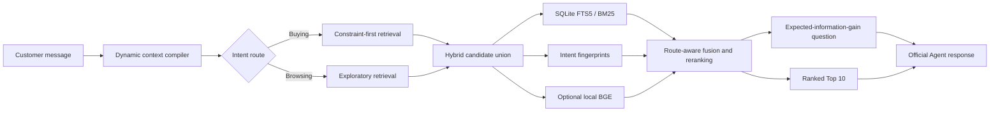

# Cartographer

**Entropy-guided conversational product search for the TechJam 2026 Shopping Copilot challenge.**

Cartographer treats shopping dialogue as active search. On every turn it ranks the best products it can identify *and* asks the question expected to remove the most uncertainty. It runs locally on CPU, uses no paid API, reports zero LLM tokens, and preserves the organizer's required `Agent` interface.

## Why this approach

Keyword search is effective once a shopper knows the exact product terms, but weak for vague browsing, evolving preferences, and corrections. Cartographer compiles each product into a structured intent fingerprint and maintains an explicit, replaceable session state. It can therefore distinguish hard constraints from soft preferences, forget superseded intent, avoid repeating known misses, and choose clarification attributes according to expected information gain.



## Features

- Buying/Browsing intent routing with deterministic, explainable behavior.
- Structured constraints with strength, source turn, active state, and intent epoch.
- Explicit correction handling that removes stale preferences while retaining the category.
- Boundary handling that records “no preference” without creating a false negative constraint.
- Catalog-derived fingerprints for category, material, color, size, style, brand, budget, features, and use case.
- Persistent SQLite FTS5 index and reciprocal-rank-style lexical features.
- Optional offline `BAAI/bge-small-en-v1.5` embeddings and MiniLM cross-encoder.
- Optional route-specific linear reranker promoted only by out-of-fold score gains.
- Entropy-based next-best-question selection with profile-aware attribute priors.
- Implicit negative feedback: products returned on an unsuccessful turn are not repeated.
- Diagnostic traces kept outside the strict official response schema.

## Repository layout

```text
cartographer/                 Runtime engine and development commands
starter/agent.py              Official Agent entry point
evaluator/local_evaluator.py  Organizer-provided deterministic evaluator
tests/                        Contract, scenario, integrity, and unit tests
docs/                         Competition rules and submission materials
data/                         Public sessions and local catalog location
```

## Setup

Python 3.10 or newer is required. The deterministic runtime uses only the Python standard library.

1. Download `catalog.jsonl.gz` from the [official participant release](https://github.com/TechJam2026/techjam-conversational-search/releases/tag/participant-kit).
2. Verify its SHA-256 checksum using the release's `SHA256SUMS` file.
3. Extract it to `data/catalog.jsonl`.
4. Build the persistent lexical index:

```bash
python -m cartographer.build_index
```

The agent automatically builds an in-memory FTS index if the cached index is absent, but the persistent index materially improves startup time.

### Optional semantic routes

Install the declared local-model dependencies and precompute BGE embeddings:

```bash
python -m pip install -r requirements.txt
python -m cartographer.build_embeddings --device cuda --batch-size 128 --dtype float32
```

The setup command saves both document embeddings and a local copy of the query encoder under `data/cartographer_index/`, validates the frozen catalog checksum and ASIN row ordering, and allows inference without network access. See [docs/GPU_EMBEDDING_HANDOFF.md](docs/GPU_EMBEDDING_HANDOFF.md) for the cross-machine workflow. To cache the experimental cross-encoder as well:

```bash
python -m cartographer.build_index --with-cross-encoder
```

The current measured result keeps both semantic extensions disabled while a portable GPU-built embedding artifact is prepared. On the test CPU, the verified BGE model's first 128-document batch took 56.62 seconds, projecting about six hours for the full catalog build. The cross-encoder is evaluated only after dense retrieval clears its score and latency gates. Missing optional packages or model assets never prevent the deterministic agent from running.

After importing a GPU-built artifact, follow the score, scenario, determinism, and latency gates in [docs/SEMANTIC_PROMOTION.md](docs/SEMANTIC_PROMOTION.md). Dense inference is deliberately opt-in and cannot silently change the official agent merely because artifacts exist.

After selecting the semantic configuration, [docs/LEARNED_RANKER.md](docs/LEARNED_RANKER.md) describes the leakage-safe five-fold training and promotion procedure for the dependency-free residual reranker.

## Run and reproduce

Run every test:

```bash
python -m unittest discover -v
```

Run the untouched official evaluator:

```bash
python -m evaluator.local_evaluator --output results.json
```

Inspect a complete conversational trace:

```bash
python -m cartographer.demo --sample-id public_0002
```

Launch the local evaluator observatory to inspect all 200 targets, replay complete conversations, view every recommended product and inference feature, and compare the deterministic and learned rerankers:

```bash
python -m pip install -r requirements-dashboard.txt
python -m cartographer.dashboard --inbrowser
```

See [docs/DASHBOARD.md](docs/DASHBOARD.md) for the panel guide and methodology warnings.

Run component ablations or five-fold weight tuning:

```bash
python -m cartographer.experiments --mode ablation --output ablation_results.json
python -m cartographer.experiments --mode tune --output tuning_results.json
```

## Official interface

```python
from starter.agent import Agent

agent = Agent("data/catalog.jsonl")
agent.reset("session-1", user_profile)
response = agent.respond("session-1", user_message, turn=1, top_k=10)
```

The response contains only `message`, `ask_attribute`, `recommendations`, and zero-valued `usage`. Diagnostics are accessed separately with `agent.get_trace(session_id)` and are never sent to the evaluator.

## Evaluation

The published starter baseline has Hit Rate@10 `0.125`, MRR `0.068034`, MTTC `9.81`, and computed TechnicalScore `0.10671`. On two byte-identical runs of the untouched 200-session official evaluator, the current offline Cartographer configuration achieves Hit Rate@10 `1.000`, MRR `0.792323`, MTTC `1.89`, and TechnicalScore `0.919897`. The protected checkpoints remain available at Git tags `checkpoint-0.865767` and `working-0.883665`. Full scenario metrics and reproducibility notes are recorded in [docs/RESULTS.md](docs/RESULTS.md).

The runtime package never imports the evaluator, public labels, or ground truth. Fingerprints are derived exclusively from fields visible in the frozen catalog. Development-only demo and experiment commands may use the public evaluator exactly as permitted by the challenge.

## Cost, privacy, and operational profile

- External API calls during inference: none.
- Paid model cost: `$0`.
- Reported prompt/completion tokens: `0 / 0`.
- Network required during final scoring: no.
- Catalog and conversation data remain local.
- Heavy vector database required: no.

## Limitations and future improvements

- Attribute extraction is optimized for the frozen English clothing catalog and would need new taxonomies for other domains.
- Dense retrieval requires a one-time model download and index build; the deterministic route remains available without it.
- Profile tags indicate which attributes matter, not preferred values, so personalization intentionally affects question order more than product identity.
- The rule-based correction detector covers explicit changes well but could be extended with a compact local classifier for subtle paraphrases.
- A production system would persist consented profiles, measure online conversion lift, and add multilingual and typo-tolerant parsing.

## Data attribution

The frozen competition catalog is derived from Amazon Reviews 2023 by McAuley Lab, UCSD. See [DATA_ATTRIBUTION.md](DATA_ATTRIBUTION.md). The catalog is intentionally ignored by Git and must not be republished outside the competition's terms.

## Team contributions

The implementation includes system design, retrieval and dialogue engineering, evaluation tooling, tests, documentation, and demo preparation. Replace this paragraph with member names and their specific contributions before the final Devpost submission.
